# MDM9607 Down the Rabbit Hole: RC400L, Rayhunter, and Cross-Vendor Firmware Forensics

> **Audience:** This is a living research document, not a polished tutorial. It's the unfiltered record of my process — wrong turns included. 

---

## Table of Contents

- [Why This Device?](#why-this-device)
- [Step 1 — Pre-Purchase: FCC Docs and Internal Photos](#step-1--pre-purchase-fcc-docs-and-internal-photos)
- [Step 2 — Digging Through Rayhunter's Codebase](#step-2--digging-through-rayhunters-codebase)
- [Step 3 — How Does the Installer Actually Work?](#step-3--how-does-the-installer-actually-work)
- [Step 4 — Serial Sorcery and AT+SYSCMD](#step-4--serial-sorcery-and-atsyscmd)
- [Step 5 — Hunting the Basics: Script Crawling](#step-5--hunting-the-basics-script-crawling)
- [Step 6 — Chasing AT Commands](#step-6--chasing-at-commands)
- [Step 7 — USB Modes, VID/PID, and a Mismatch](#step-7--usb-modes-vidpid-and-a-mismatch)
- [Step 8 — ATFWD Daemon Deep Dive](#step-8--atfwd-daemon-deep-dive)
- [Step 9 — EDL and Fastboot Modes](#step-9--edl-and-fastboot-modes)
- [Step 10 — Firmware Backup via EDL](#step-10--firmware-backup-via-edl)
- [Step 11 — QCSuper, QPST, and EFS Explorer](#step-11--qcsuper-qpst-and-efs-explorer)
- [Step 12 — AT Command Surface Area (AT+CLAC)](#step-12--at-command-surface-area-atclac)
- [Pivoting: Why Look at the JMR540?](#pivoting-why-look-at-the-jmr540)
- [Step 13 — Getting the JMR540 Firmware](#step-13--getting-the-jmr540-firmware)
- [Step 14 — Platform Fingerprinting](#step-14--platform-fingerprinting)
- [Step 15 — The Binary Audit (667 vs 569)](#step-15--the-binary-audit-667-vs-569)
- [Step 16 — Key Findings by Category](#step-16--key-findings-by-category)
- [Step 17 — Staging PortableApps for the RC400L](#step-17--staging-portableapps-for-the-rc400l)
- [Step 18 — The TR-069 Rabbit Hole (cwmpCPE)](#step-18--the-tr-069-rabbit-hole-cwmpcpe)
- [Step 19 — The SMB Dead End](#step-19--the-smb-dead-end)
- [Step 20 — Getting tcpdump Working: Escaping the Capability Jail](#step-20--getting-tcpdump-working-escaping-the-capability-jail)
- [Step 21 — Live iptables Control: QCMAP-Safe Daemon Architecture](#step-21--live-iptables-control-qcmap-safe-daemon-architecture)
- [Retrospective: What I'd Do Differently](#retrospective-what-id-do-differently)
- [What's Next](#whats-next)

---

## Why This Device?

After seeing the EFF's [Rayhunter project](https://github.com/EFForg/rayhunter) I noticed a few things that immediately piqued my interest.

**The hardware:**
- Cheap. Currently under $15 on eBay — I found one for $11.
- Qualcomm SoC (MDM9207/MDM9607). I have background with esoteric Qualcomm cellular modems and protocols.
- ARM Cortex-A7
- Dual-band WiFi (2.4 + 5 GHz)
- 4G LTE functionality
- Physical SIM slot
- USB-C

**Rayhunter's angle:**
- Specifically mentions `/dev/diag` — a Qualcomm diagnostic interface I have prior familiarity with
- Root is technically accessible via Rayhunter, but the project keeps it narrowly scoped to its IMSI catcher detection use case
- Plenty of surface area to expand — good foundation to build on or pivot toward unrelated cellular/wireless research

**What I wanted out of it:**
- Rayhunter is written mostly in Rust. I have zero formal experience reading or writing Rust. Good excuse.
- This MDM9207 SoC differs from prior Qualcomm research I've done but should have meaningful overlap
- Genuine curiosity: what's the difference between a hotspot and a phone when it comes to the LTE stack? Can you MITM both directions simultaneously — endpoint-to-WiFi AND WiFi-to-LTE?
- Rayhunter is hunting fake cell sites. What else is visible if you drop that specific focus entirely?

This document started as scattered notes and facts-and-findings, then I decided to structure it into something that shows my process for reverse engineering both the physical device and the Rayhunter installer. After a conversation with an interviewer who asked "can you share your process," I realized I'd rather demonstrate it than describe it. This is that demonstration.

Fair warning: because "showing the process" is the goal, the flow can seem backwards in places. This is a black-box device I happened to have the luxury of root on. Instead of working *toward* root as the objective, the starting point was (a) how does existing root access work, and (b) how do we expand functionality completely independent of Rayhunter.

---

## Step 1 — Pre-Purchase: FCC Docs and Internal Photos

Before I bought anything I pulled the FCC filings. This is a habit I'd strongly recommend for any IoT/embedded research target — you can learn a lot about a device without ever touching it.

**FCC ID:** `2ABGH-RC400L`
- Filing: https://fccid.io/2ABGH-RC400L
- Internal photos: https://fccid.io/2ABGH-RC400L/Internal-Photos/Internal-Photos-4714662

**Notes from the internal photos:**

The device has plenty of options for external antennas but ships with compression-style antennas by default. Out of the box the range is fairly limited for anything that needs strong cellular signal — but crucially, there appears to be room to expand without hardware modification (*maybe*). Worth revisiting.

There's also what appears to be an unused RGB LED header. No idea if this is wired up in firmware or just a floating PCB pad. Filed away as "interesting, return to later."

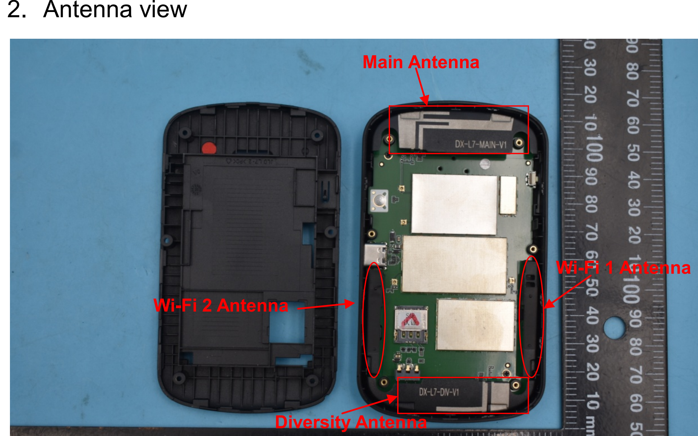
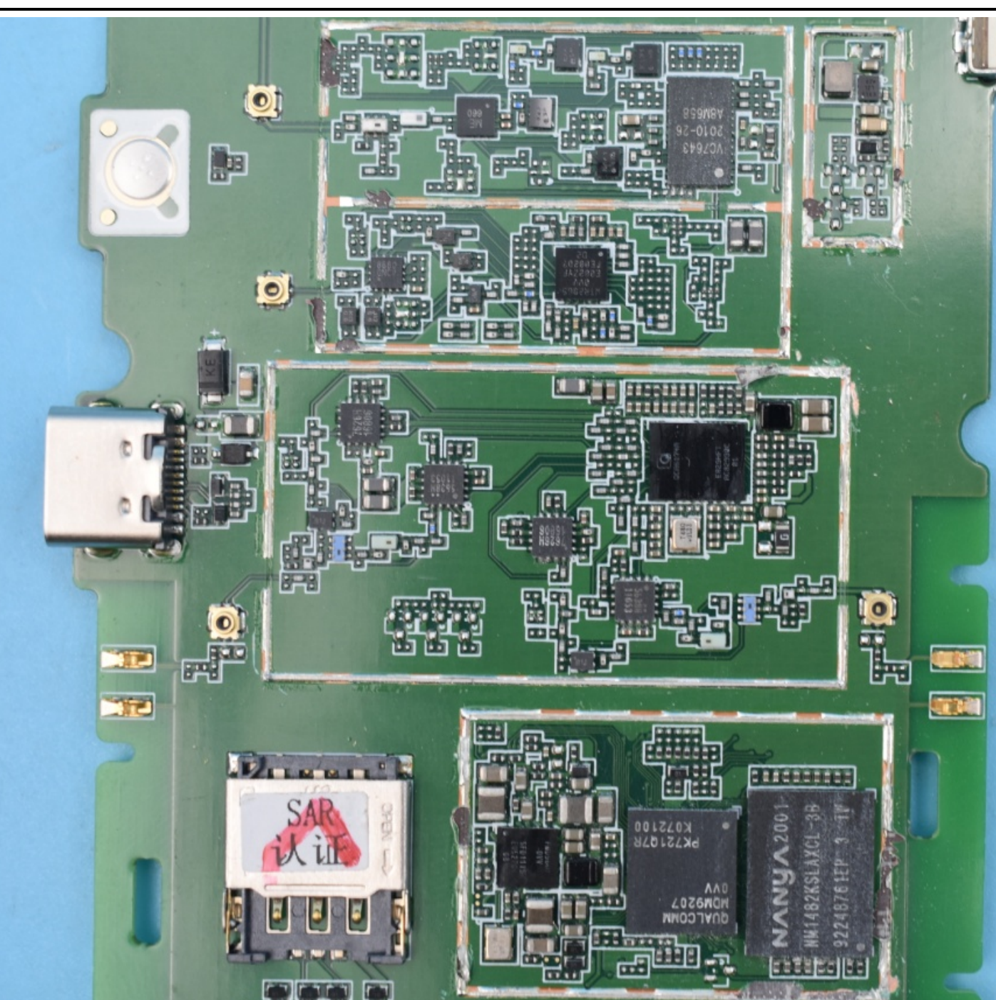
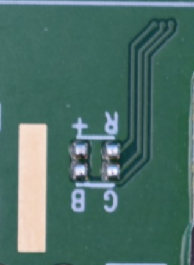

---

## Step 2 — Digging Through Rayhunter's Codebase

I'll skip the installation walkthrough — the [Rayhunter README](https://github.com/EFForg/rayhunter) covers it well. A few quick notes post-install instead.

**Accessing root after Rayhunter installs:**

Rayhunter does not replace the existing `su` binary or modify the root password. Instead it pushes its own binary called `rootshell`:

```bash
# On local PC
adb shell

# In the ADB user shell
rootshell
```

This is actually a quality-of-life win. The rootshell binary is a proper bash shell with color support — a real shell as god intended, not some stripped busybox `sh`. This distinction matters when you're doing complex one-liners later.

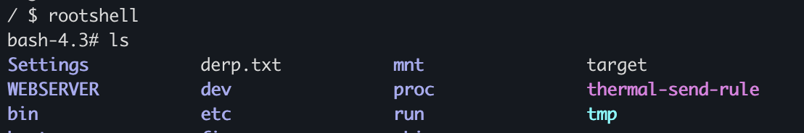

The high-level of what the Rayhunter installer does:
- Changes USB mode from stock using a special USB control query
- Enables ADB
- Sends AT commands to the system shell
- Pushes the `rootshell` binary, sets permissions, pushes its web server binary

That last bullet point is where things get interesting. *How* does it send AT commands before ADB is even available?

---

## Step 3 — How Does the Installer Actually Work?

Let's actually trace through the install process instead of treating it as a black box.

**[install-linux.sh](https://github.com/EFForg/rayhunter/blob/main/dist/install-linux.sh)** calls a binary called `serial` from the downloaded package.

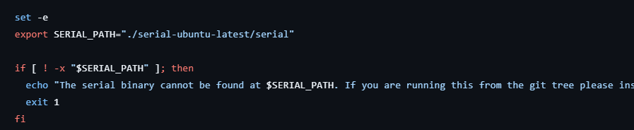

**[install-common.sh](https://github.com/EFForg/rayhunter/blob/main/dist/install-common.sh)** is where the actual orchestration happens. The sequence is roughly:

1. Call `serial --root` to get elevated access to the device shell
2. Use `adb push` to copy `rootshell` and set its permissions
3. Rayhunter's web UI is served via a simple `adb forward`

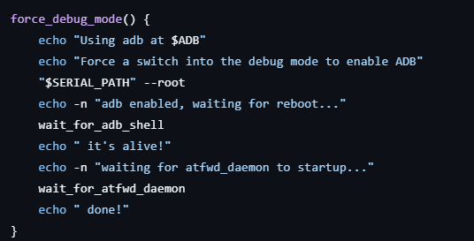
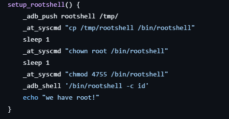

The `wait_for_atfwd_daemon` call at the end of the install script is notable — it implies the installer is *waiting* for a specific daemon to come up before proceeding. That daemon name is a clue. More on that in a moment.

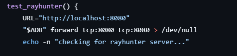

---

## Step 4 — Serial Sorcery and AT+SYSCMD

**[serial/src/main.rs](https://github.com/EFForg/rayhunter/blob/main/serial/src/main.rs)**

The `serial` binary accepts either a command string or `--root`. There's a key line in there: it sends an AT command.

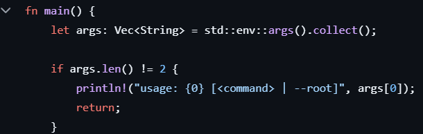

That's what we want. But initially there's no indication of the exact format or what AT commands are supported.

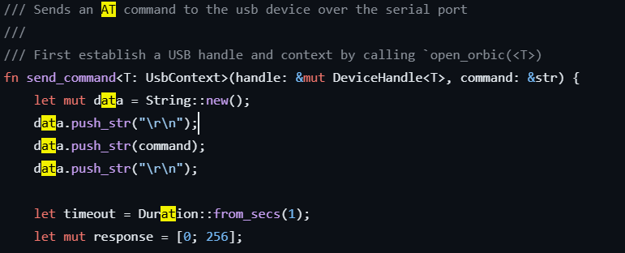

Working backwards from `install-common.sh`, the `--root` flag resolves to something like:

```
serial "AT+SYSCMD=<shell command here>"
```

It's just wrapping AT+SYSCMD and stuffing a shell command into it. The "serial" mystery was a function wrapper around a single AT command. That's it.

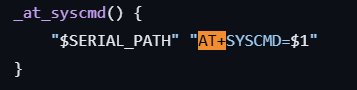

**Sidebar on Mac:** There's a frustrating platform-specific note buried in the Rust source — something that will bite Mac users. I'm on Windows/Linux, so I dodged this, but it's worth flagging for anyone following along on macOS. The serial port enumeration behaves differently and the install script has workarounds that aren't always obvious.

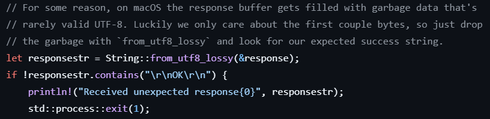

**Manual AT+SYSCMD demo:**

Once you understand what `serial` is doing, you can replicate it manually:

```bash
# Using the serial binary directly from the rayhunter package
./serial "AT+SYSCMD=id"
# Returns: OK (the command ran but output isn't echoed back over USB)
```

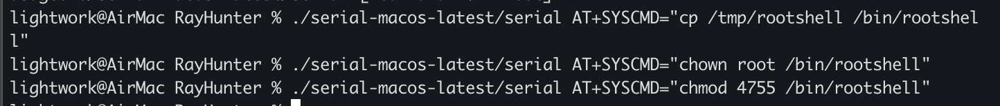

This leads to the first real frustration: AT+SYSCMD executes commands but you don't get stdout back in the AT response. You only get `OK` or an error. Output is written elsewhere — specifically to `/data/logs/atfwd.log`.

**What atfwd.log gives you:**

```
Nov 19 22:48:44 mdm9607 local3.info ATFWD[1069]: Registered AT Commands event handler
Nov 19 22:48:44 mdm9607 local3.info ATFWD[1069]: Waiting for ctrCond
```

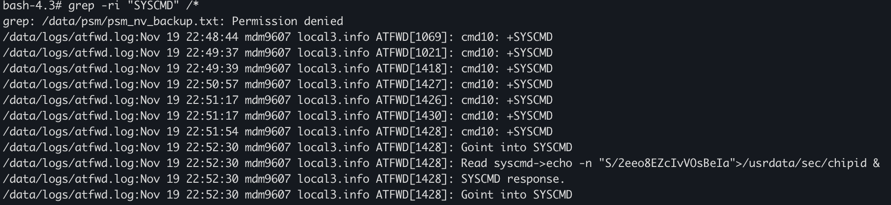

Grepping that log for `+SYSCMD` reveals the exact commands the Rayhunter installer ran — which is both useful for understanding what happened and useful as a debugging channel when you're running your own commands and can't trust the terminal output.

**Summary of what AT+SYSCMD gives us:**
- A way to send shell commands with elevated permissions via USB serial (before ADB is up)
- A binary (`serial`) and AT mode to do it
- `atfwd.log` as the only reliable debug channel for those commands

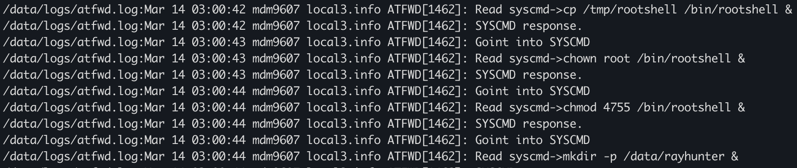

---

## Step 5 — Hunting the Basics: Script Crawling

When I'm trying to understand "how does this device actually work at a system level," my first move on any embedded Linux target is to crawl for shell scripts. Even without root, scripts often reveal execution flow, elevated calls, or things that survive across reboots.

Basic search pattern:
```bash
find / -name "*.sh" 2>/dev/null
```

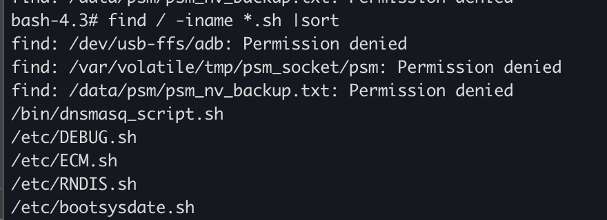

One result that jumped out immediately: `DEBUG.sh`

That sounds interesting. I noted it and moved on to chase the AT command angle first — then came back to it, because hunting scripts paid off in a different way than expected.

---

## Step 6 — Chasing AT Commands

While searching for RC400L rooting info I found an XDA thread that didn't initially match what Rayhunter was doing — but a specific comment flagged two AT commands: `AT+SYSCMD` (which Rayhunter clearly uses) and something called `AT+SER`.

The thread mentioned `AT+SER` as a USB mode switcher but didn't explain *how* that conclusion was reached.

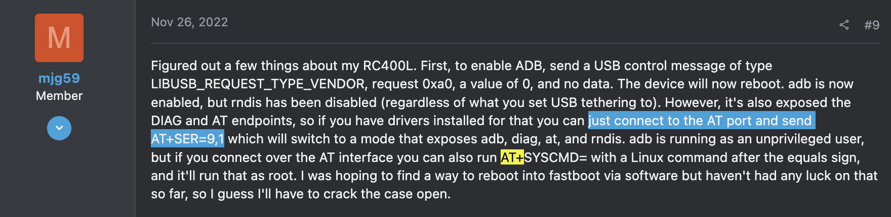

Going back to the shell scripts found earlier — the answer was in there:

The scripts contain explicit references to modes `1` and `9`, with `echo` commands containing the strings `"serial"` and `"adb"`. The mode switch mechanism was documented in the device's own init scripts. The AT command research and the script crawling converged on the same information from two different directions.

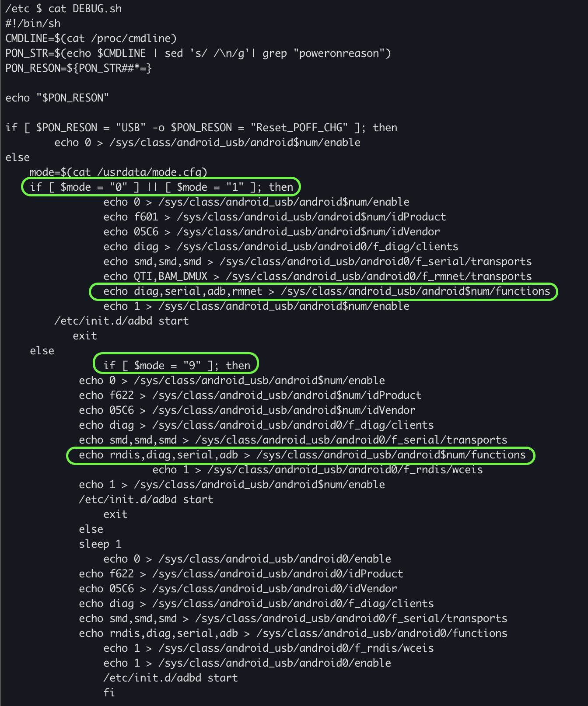

**Lesson:** When you're researching a device, the device often documents itself. Shell scripts in `/etc/init.d/`, `/etc/`, or scattered across `/data/` frequently contain exactly the information you're looking for — you just have to look.

---

## Step 7 — USB Modes, VID/PID, and a Mismatch

From prior Qualcomm research I know the VID for 9008 EDL (Emergency Download) mode is `05C6`:

```
USB\VID_05C6&PID_9008
```

This VID shows up in the device's USB configuration files too, which confirms the device supports 9008 mode (useful for firmware flashing and full partition dumps).

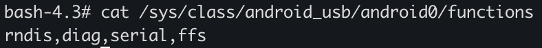

**A notable mismatch:**

Rayhunter's serial binary uses `0xF626` as the USB composition value. But `/etc/debug.sh` sets `0xF622`. These are different USB compositions, meaning Rayhunter is deliberately picking a different mode than what debug.sh establishes.


```bash
cat /data/usb/boot_hsusb_composition
```

This file defines ~20 USB state modes. The discrepancy between `F622` and `F626` is worth noting — it suggests Rayhunter made a deliberate choice about which USB interface profile to expose. Whether this matters for anything beyond driver compatibility on the host side is an open question.

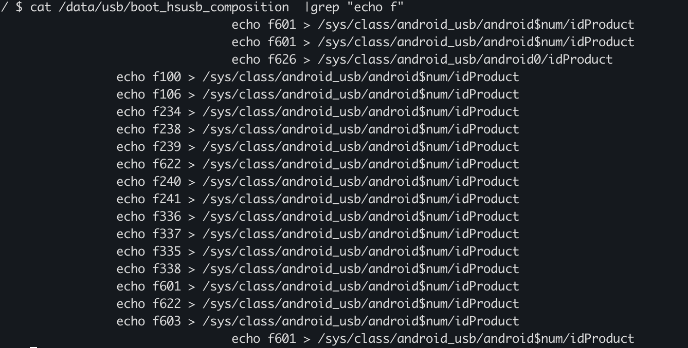

The `boot_hsusb_composition` file also provides kernel notes on `/dev/diag` which is relevant if you want to use QCSuper (covered later).


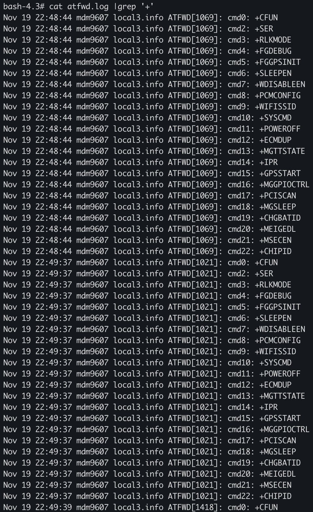

---

## Step 8 — ATFWD Daemon Deep Dive

The `wait_for_atfwd_daemon` call in the installer, combined with `+SYSCMD` in `atfwd.log`, pointed me toward the ATFWD daemon as a target worth understanding.

Running strings on the `atfwd` binary reveals:
- AT baud rate settings and config file references
- A binary in `/sbin/` that can reboot to EDL mode (more on that shortly)
- Echo commands, daemon calls, and TTY definitions
- Loads of internal state management


The log file at `/data/logs/atfwd.log` is the reliable output channel for everything. Grepping it for AT commands beyond `+SYSCMD` gives you the full registered command list that the daemon handles — and one particular grep is a BINGO moment that reveals the full set of registered AT commands the device responds to.

```bash
grep -i "registered AT" /data/logs/atfwd.log
```


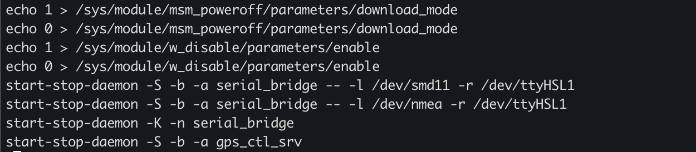
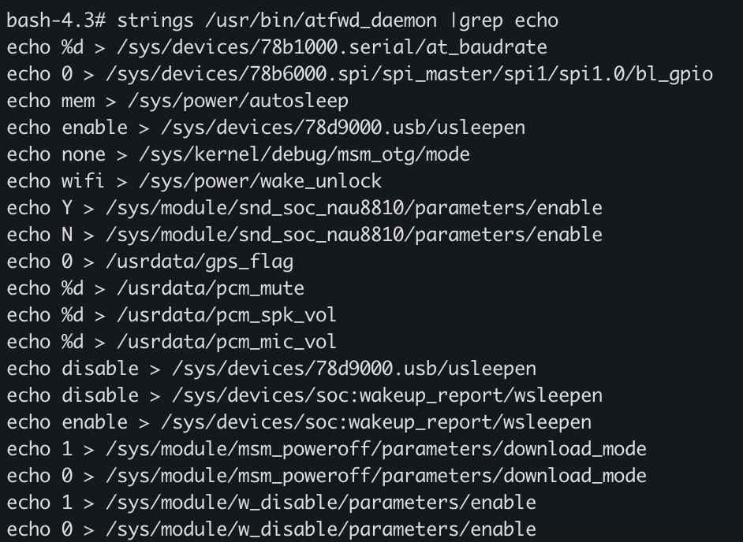

---

## Step 9 — EDL and Fastboot Modes

This is where the research diverges meaningfully from "just use Rayhunter."

The ATFWD strings mentioned a binary that can reboot the device into EDL mode. Exciting — but when you try to call it directly from `rootshell`, it fails. Permissions, likely, or it requires a specific invocation context.

Physical alternative: **you have to pry up the screen to access the physical EDL pads**, which are under the LCD after removing the case. This isn't covered in Rayhunter at all, and it's a perfect example of the difference between "using a convenient installer" and actually learning the device.

The XDA thread at https://xdaforums.com/t/resetting-verizon-orbic-speed-rc400l-firmware-flash.4334899/#post-86616269 is where I first found details on boot modes. That thread also contains pre-root research from other people that has genuinely useful detail — worth reading in full.

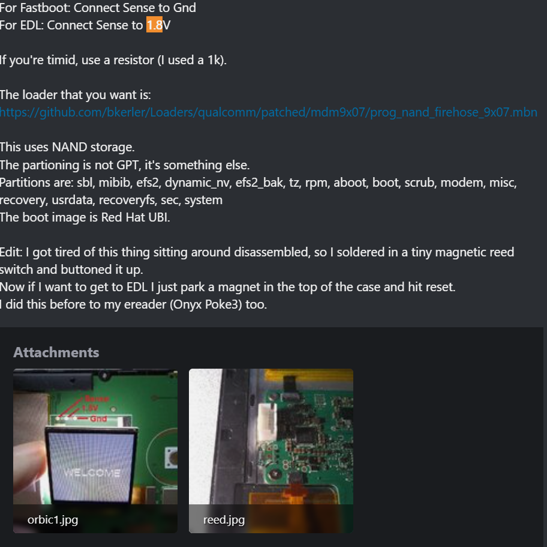

**USB ports exposed during firmware flashing:**

If you unplug the device mid-update (as described in that thread), Windows exposes a different set of COM ports. This is cleaner to parse on Windows than via `lsusb` on Linux because Windows enumerates them with VID/PID labels. The VID `05C6` appears for the 9008 debug mode interface, and **QPST works with that driver.**


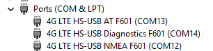


---

## Step 10 — Firmware Backup via EDL

Once you understand EDL mode, backing up the full firmware is straightforward using [bkerler/edl](https://github.com/bkerler/edl) with the `rl` (read-all) flag:

```bash
edl rl [OUTPUT_DIR]
```

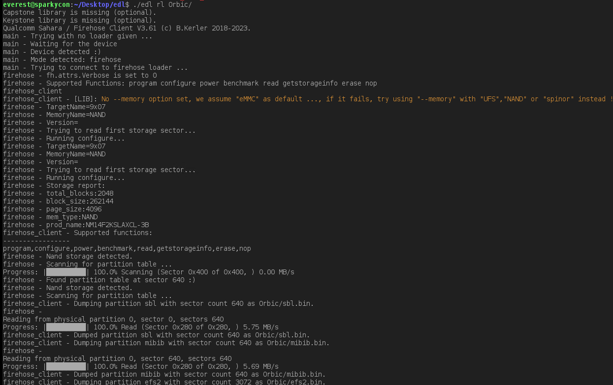
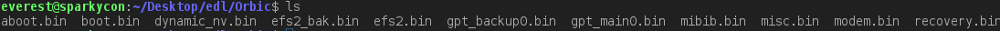

This dumps every partition the EDL loader exposes. Keep a backup. Seriously. I've bricked enough devices to make this a reflex.

The partitions of interest for system-level research:
- `system` — main rootfs
- `recovery` — recovery image
- `cache` — overlay/cache partition
- `modem` — baseband firmware (separate from application processor)
- `userdata` / `usrfs` — persistent user data

The modem partition is worth a separate look if you're interested in the baseband — it's a completely separate RTOS running on the modem DSP, with its own filesystem.

---

## Step 11 — QCSuper, QPST, and EFS Explorer

Two tools that are useful at this layer:

**QCSuper** (https://github.com/P1sec/QCSuper) — captures live cellular traffic via the Qualcomm DIAG interface (`/dev/diag`). Useful for getting pcaps of the modem's radio-level communications.

```bash
# Example pcap capture via DIAG
qcsuper --usb-modem <VID:PID> --wireshark-live
```

The `boot_hsusb_composition` settings matter here — you need the DIAG interface exposed over USB for QCSuper to work.

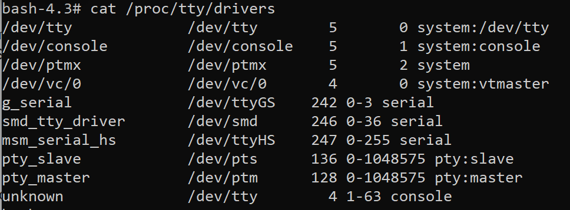
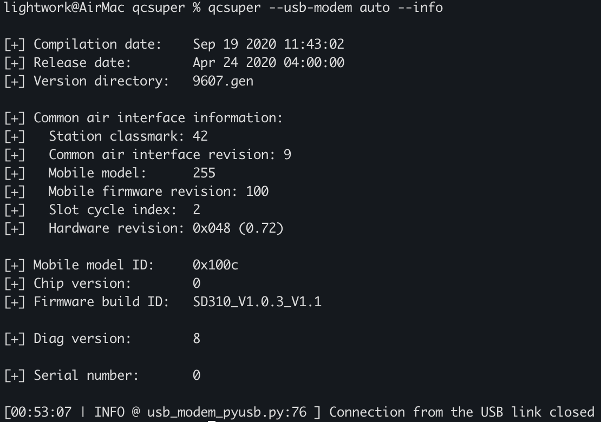
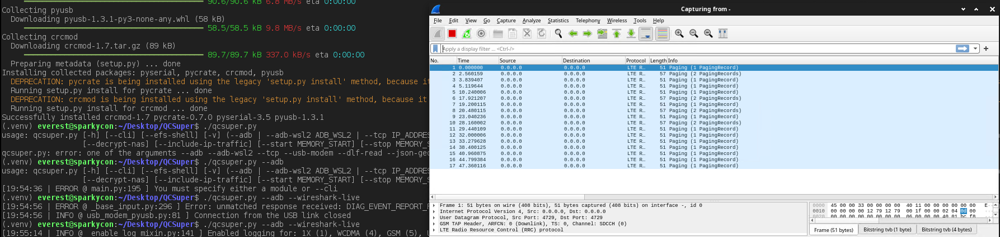

**QPST (Qualcomm Product Support Tools)** is the official Qualcomm toolkit. With the right driver and 9008/DIAG mode:

- **Phone Properties** — reports IMEI, software version, hardware info
- **Service Programming** — allows NV item reads and writes
- **EFS Explorer** — filesystem explorer for the modem's Embedded File System

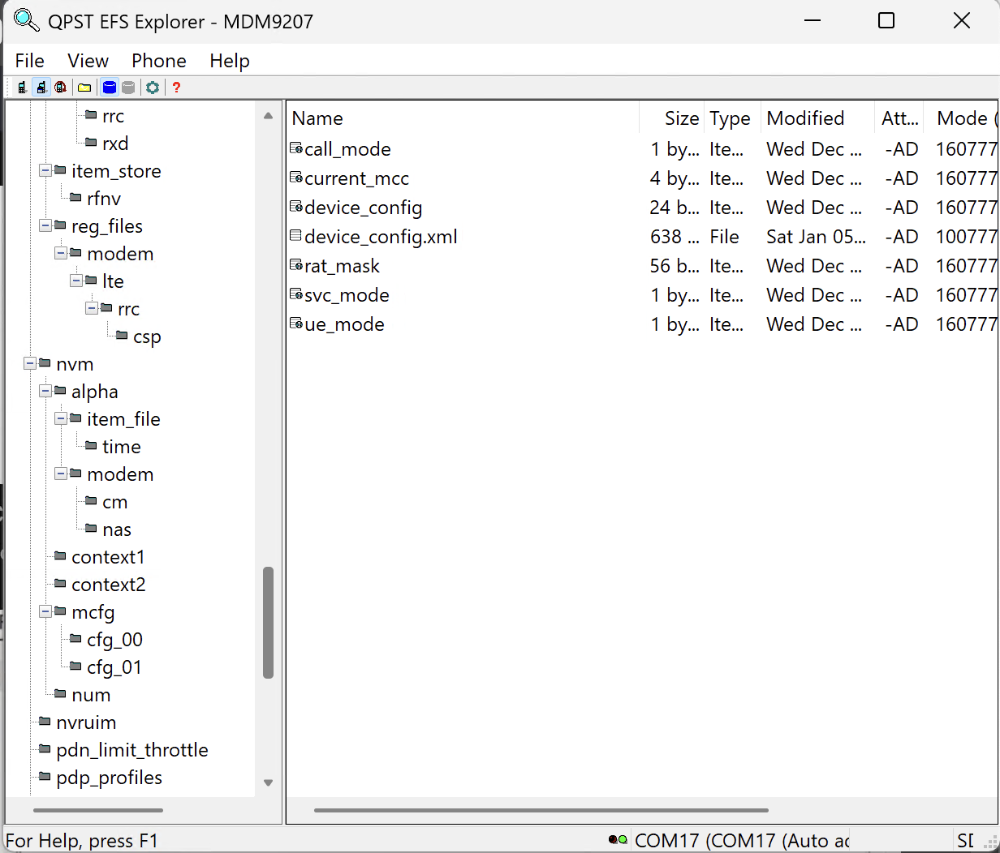
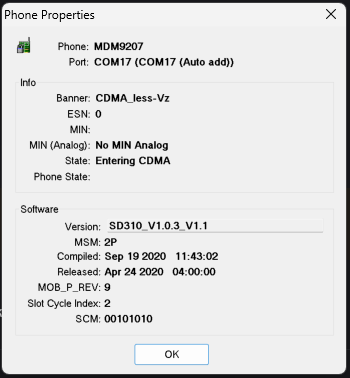
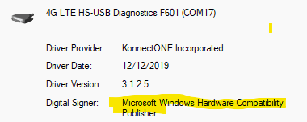
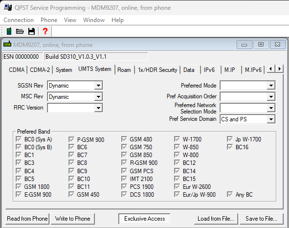
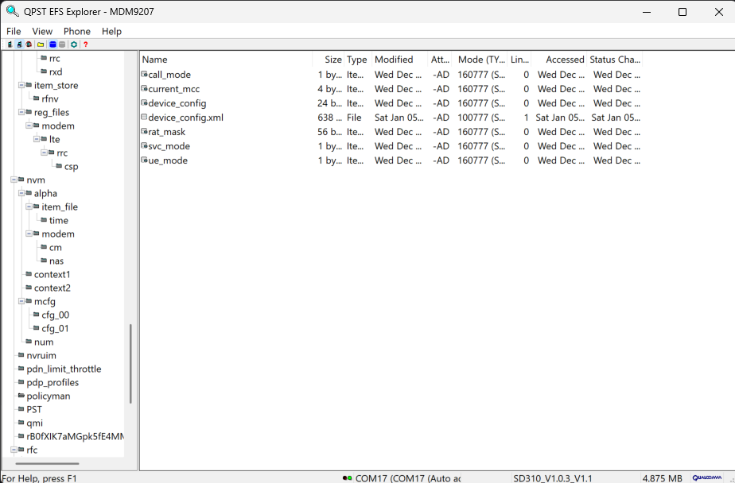

The EFS contains NV (non-volatile) items that control modem behavior. A generic NV items list is documented at https://xdaforums.com/t/qualcomm-complete-list-of-nv-items.1954029/ — the raw list has 8000+ items. Filtering for debug/diag-relevant ones:

Notable debug-related NV items:
- `NV 370` — DIAG Default SIO Baud Rate
- `NV 388` — DIAG Boot Port Selection
- `NV 403` — DIAG Restart Configuration
- `NV 1830/1833` — Diag Debug Control / Detail
- `NV 4144` — Crash Debug Disallowed
- `NV 4860` — DIAG FTM Mode Switch

---

## Step 12 — AT Command Surface Area (AT+CLAC)

The command `AT+CLAC` lists all supported AT commands on the device. Some commands use `$`, `+`, or `^` prefixes:

```
AT$QCDGEN
AT$QCCLAC    -- note: has a slightly different list than AT+CLAC, or ordering change
AT$QCDMR
```

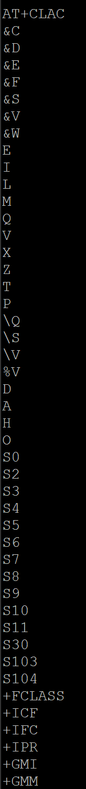
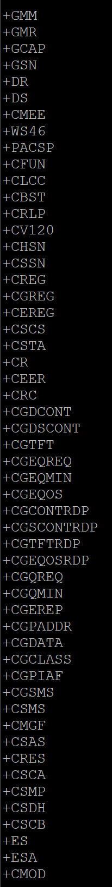
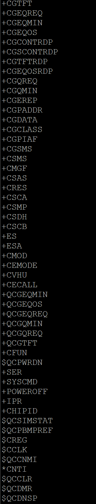
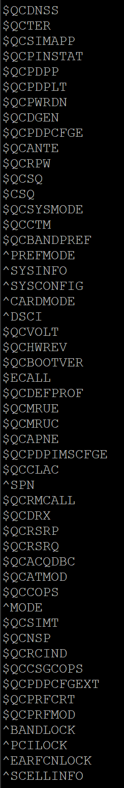

There's an interesting overlap between `AT+CLAC` and `AT$QCCLAC` — the command sets aren't identical. Whether this is a firmware version artifact or an intentional separation of AT command domains I haven't fully resolved.

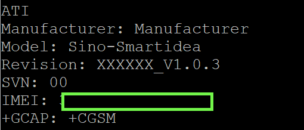
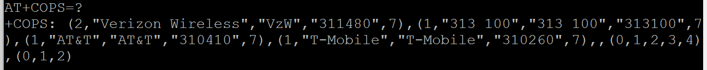

For AT terminal work: if the terminal session freezes, sending a `BREAK` signal (in PuTTY: Special Commands > Break) usually clears it.

Reference for Qualcomm modem AT commands that are hard to find elsewhere: https://manualsdump.com/en/download/manuals/maxon_telecom-mm-6280ind/143553

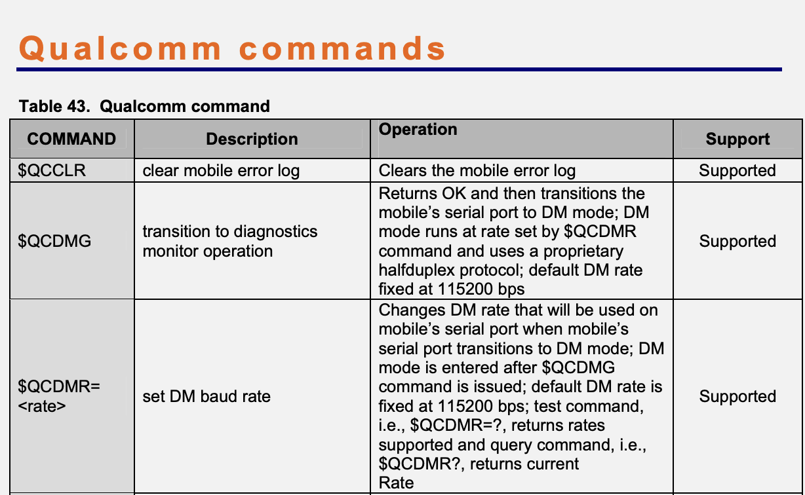

A separate angle: the SIM7600 module documentation. The SIM7600 ships with a Qualcomm MDM9607 chipset and its AT command manual (V1.07) covers a command set that overlaps meaningfully with what the RC400L responds to. If you're reverse-engineering AT command behavior and hitting gaps in the RC400L docs, cross-referencing the SIM7600 manual is a productive shortcut.

TR-069 reference docs also came up during this research. The RC400L has a `tr069` binary in its rootfs — flagging it here as something to return to.

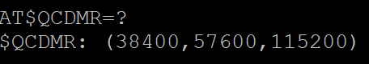
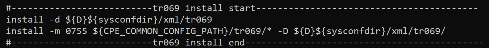

---

## Pivoting: Why Look at the JMR540?

After a few weeks of prodding the RC400L, a natural question emerged: *what does this device look like from the outside, through the lens of a similar device from a different vendor?*

The **JioFi JMR540** is a Jio (India) mobile hotspot made by Foxconn. It runs on the same Qualcomm MDM9607 SoC. Same ARM Cortex-A7. Same generation of LTE Cat-4 hardware. But different vendor, different carrier market, different software stack built on top of the same Qualcomm BSP.

The research question: **What did Foxconn ship on JMR540 that Orbic/Verizon didn't ship on the RC400L, and can any of it be ported?**

This is a common technique in embedded research — when you have limited capability on a target device, look at platform siblings. The ABI compatibility between devices using the same SoC, OS version, and C library version is often high enough that binaries are directly portable.

---

## Step 13 — Getting the JMR540 Firmware

The JMR540 firmware is publicly available. Several community dumps exist covering the main partitions of interest:

- `system` dump — most complete, main rootfs
- `recoveryfs` dump — recovery partition
- `root` dump — root with cachefs overlay applied
- `modem` image — baseband firmware partition

Focus on `system` and `recovery` first. The modem partition is a separate RTOS image and less useful for application-layer research unless you're going deep on the baseband.

**Extraction tooling note (Windows pain):**

Getting UBI filesystem images to extract on Windows is not pleasant. `ubireader` exists but the Windows path for the installed script is not what you'd expect:

```
C:\Users\<user>\AppData\Roaming\Python\Python314\Scripts\ubireader_extract_files.exe
```

Use the full path. Don't try to rely on it being in PATH on Windows Git Bash. I wasted time on this.

**WSL note:** WSL Ubuntu is available as an alternative, but don't ever use `--break-system-packages` with pip on it. Use a venv. Always.

---

## Step 14 — Platform Fingerprinting

Before doing any binary analysis, establish the ground truth on both platforms. This determines what's actually portable.

| Property | RC400L (Orbic) | JMR540 (Foxconn/Jio) |
|----------|---------------|----------------------|
| SoC | Qualcomm MDM9607 | Qualcomm MDM9607 |
| CPU | ARM Cortex-A7 (armv7, 32-bit) | ARM Cortex-A7 (armv7, 32-bit) |
| C Library | glibc 2.22 | glibc 2.22 |
| OpenSSL | 1.0.0 | 1.0.0 |
| Init system | SysV (`/etc/init.d/`) | SysV (`/etc/init.d/`) |
| IPC stack | QMI/QCMAP | QMI/QCMAP |
| Busybox size | 1.26 MB (~183 applets) | 979 KB (~152 applets) |
| Busybox extras | chattr, lsattr, su, login | fatattr, sha3sum |
| Root password | Inline in `/etc/passwd` (MD5 `$1$`) | In `/etc/shadow` (DES crypt) |

**glibc 2.22 on both = ABI compatibility.** Binaries compiled for one will generally run on the other, as long as their library dependencies are satisfied. This is the key finding that makes the entire PortableApps effort viable.

**The busybox difference is interesting in both directions:**

- Orbic's busybox is larger and has `su` and `login` as busybox applets
- JMR540's busybox is smaller but has `fatattr` and `sha3sum` not compiled into Orbic's build
- JMR540 ships standalone shadow suite binaries (`su.shadow`, `login.shadow`) instead of relying on busybox

**Password storage difference:**

The Orbic stores root password directly in `/etc/passwd` as an MD5 hash — old-school, no shadow file. The JMR540 has a proper `/etc/shadow` setup with DES crypt hashes. This matters if you're trying to port the shadow suite tools: the Orbic doesn't have `/etc/shadow` at all, so you'd need to create it.

---

## Step 15 — The Binary Audit (667 vs 569)

**Methodology:**

With both firmware sets extracted, the process was:

1. Enumerate every file in `bin/` and `sbin/` on both devices (recursively, following symlinks)
2. Record names, sizes, and whether each entry is a binary or symlink
3. Diff the two lists to find what's unique to each
4. For each unique-to-JMR540 binary, extract its ELF dynamic dependency list

**Dependency extraction without readelf:**

Here's where Windows tooling limitations bite again. No `readelf`, no `strings` in Git Bash. Workaround:

```bash
tr '\0' '\n' < binary_file | grep -E '^lib.*\.so'
```

This converts the null-separated ELF string table into newlines and greps for shared library names. Not elegant, but it works. Cross-referencing against Orbic's rootfs with a recursive `find` tells you which deps are already satisfied.

**Results:**
- RC400L (Orbic): **569** bin/sbin entries
- JMR540 (Foxconn): **667** bin/sbin entries
- **131 unique-to-JMR540** binaries analyzed

---

## Step 16 — Key Findings by Category

### Tier 1 — Immediate Value (Auth & Privilege)

The JMR540 ships a complete shadow-utils suite that the Orbic simply doesn't have:

| Binary | Size | Notes |
|--------|------|-------|
| `su.shadow` | 36 KB | Full su with shadow support. Orbic has NO su binary at all. |
| `login.shadow` | 68 KB | Full login with PAM/shadow. |
| `passwd.shadow` | 42 KB | Standalone password changer. |
| `vipw.shadow` | 43 KB | Safe passwd/shadow editor. |
| `nologin` | 6 KB | Account lockout utility. |

The Orbic's busybox has `su` as an applet, but it's the stripped-down busybox version. The shadow suite versions are proper implementations.

### Tier 2 — User/Group Management

The full shadow-utils package: `useradd`, `userdel`, `usermod`, `groupadd`, `groupdel`, `groupmod`, `groupmems`, `newusers`, `chage`, `chpasswd`, `pwck`, `grpck`, `lastlog`, `faillog`, and more. The Orbic has none of these as standalone tools.

### Tier 3 — Network Tools

| Binary | Notes |
|--------|-------|
| `xtables-multi` | iptables/ip6tables unified binary. **Orbic has NO iptables binary.** All the iptables libs (`libip4tc`, `libip6tc`, `libxtables`) already exist on the Orbic — this binary is a drop-in. |
| `wpa_supplicant` | WiFi client mode. Not on Orbic. Needs `libwpa_client.so`. |
| `wpa_cli` / `wpa_passphrase` | WPA supplicant control tools. |
| `pppd` | PPP daemon. Serial/modem/VPN connections. |
| `chat` | Modem chat scripts (used with pppd). |
| `tinyproxy` | Lightweight HTTP proxy. |
| `thttpd` | Lightweight HTTP server. |
| `conntrackd` | Connection tracking daemon. |
| `ddclient` | Dynamic DNS client (Perl). |
| `nfnl_osf` | OS fingerprinting via netfilter. |

**The iptables finding is significant.** The Orbic's entire netfilter/iptables infrastructure exists in shared libraries already — Orbic just ships zero iptables binaries. `xtables-multi` from JMR540 satisfies all dependencies against what's already on the Orbic. Drop it in and you have full firewall control.

### Tier 4 — D-Bus (IPC Framework)

The JMR540 ships a full D-Bus stack: `dbus-daemon`, `dbus-send`, `dbus-monitor`, `dbus-launch`, `dbus-run-session`. The Orbic has no D-Bus at all.

**Catch:** These require `libdbus-1.so.3` which is also absent on Orbic. Bringing the binaries means bringing the library — but it's a self-contained dependency (no further chain required).

### Tier 5 — MCM Framework (Additional Modem Control)

| Binary | Notes |
|--------|-------|
| `MCM_MOBILEAP_ConnectionManager` | MCM mobile AP manager |
| `MCM_ATCOP_CLI` | MCM AT command CLI |
| `mcm_ril_service` | MCM RIL (Radio Interface Layer) |
| `MCM_atcop_svc` | MCM AT command service |

Requires `libmcm.so.0`, `libmcmipc.so.0`, `libmcm_log_util.so.0` — all on JMR540 only. Portable as a bundle.

### Tier 6 — Foxconn Device Management

| Binary | Notes |
|--------|-------|
| `cfg` | Foxconn configuration management CLI (452 KB) |
| `cwmpCPE` | **TR-069 CPE client** — remote device management |
| `simlock` | SIM lock/unlock |
| `freset` | Factory reset |
| `thttpd.sh` | Init script for the HTTP server |

This tier is where Foxconn-specific binaries live. Some of these will have Foxconn-specific library dependencies or assume Foxconn partition layout — not all of them are portable despite ABI compatibility.

### Tiers 7-8 — Audio and GPS (Dead Ends for Porting)

The JMR540 has a full ALSA audio stack (`aplay`, `arec`, `amix`, `alsaucm_test`) and GPS/location tools (`garden_app`, `location_hal_test`).

These are not portable:
- **Audio** needs 7+ missing libraries: `libalsa_intf.so.1`, `libaudioalsa.so.1`, `libaudcal.so.1`, `libacdbloader.so.1`, and more
- **GPS** needs 18+ location libraries: `libloc_*.so`, `libgps_*.so`, `libgeofence`, `libizat_core`, etc.

None of these exist on the Orbic, and pulling them all in would be a significant undertaking for uncertain payoff on a device that wasn't designed with location or audio hardware in mind.

### Notable Things Orbic Has That JMR540 Doesn't

| Binary | Notes |
|--------|-------|
| `LKCore` | Orbic's main application (LittleKernel-based UI) |
| `goahead` | GoAhead web server (JMR540 uses thttpd) |
| `mbimd` | MBIM daemon (JMR540 is QMI-only) |
| `iperf` / `iperf3` | Network performance testing |
| `sqlite3` | SQLite CLI |
| `i2cdetect/dump/get/set` | I2C bus tools |
| `oma_dm` / `dmclient` | OMA-DM device management |
| `tr069` | Orbic's own TR-069 client |
| `ethtool` | Ethernet tool |
| `nanddump/nandwrite` | NAND flash tools |
| `sigma_dut` | WiFi certification test tool |
| `perl5.22.0` | Perl 5.22 (JMR540 has 5.20) |

The `iperf`/`iperf3` presence on Orbic is genuinely useful and unexpected. The `mbimd` difference tells you something about the QMI vs MBIM interface choice — Foxconn went pure QMI, Orbic supports MBIM (which is what Windows prefers for USB modem interfaces).

---

## Step 17 — Staging PortableApps for the RC400L

With the binary audit complete, I staged the most useful candidates into a `PortableApps/` directory organized into 26 numbered packages. Total size: ~8.3 MB. All ARM 32-bit EABI5, GNU/Linux 2.6.32.

**Portability breakdown:**
- **22 of 26 packages** need zero additional libraries — every dependency is already present on the Orbic
- **4 packages** include their required libraries:
  - `09_dbus/` — includes `libdbus-1.so.3`
  - `19_traf_monitor/` — includes `libbroker.so`
  - `20_mcm_framework/` — includes 3 MCM libs
  - `06_pppd/` — optional `libpcap.so.1` (in package 08)

**Package index highlights:**

| Package | Content | Size | Notes |
|---------|---------|------|-------|
| `00_audit/` | Capability audit script | 10 KB | Run this first |
| `01_xtables/` | iptables/ip6tables | 71 KB | Drop-in ready |
| `02_shadow_suite/` | su, login, passwd, nologin | 663 KB | Needs `/etc/shadow` created |
| `03_wpa_supplicant/` | wpa_supplicant + wpa_cli | 907 KB | WiFi client mode |
| `04_thttpd/` | Lightweight HTTP server | 118 KB | Web shell / file transfer |
| `05_tinyproxy/` | HTTP proxy | 60 KB | Traffic pivoting |
| `06_pppd/` | PPP daemon + chat | 278 KB | Serial/VPN |
| `07_simlock/` | SIM lock control | 22 KB | Foxconn-specific, YMMV |
| `08_libpcap_tcpdump/` | Static tcpdump | 2.2 MB | Self-contained, no libpcap needed |
| `09_dbus/` | Full D-Bus stack | 625 KB | libdbus included |
| `10_reg/` | Register access tool | 6 KB | Hardware register read/write |
| `15_ubi_tools/` | UBI filesystem tools | 229 KB | For filesystem manipulation |
| `20_mcm_framework/` | MCM modem control | 671 KB | MCM libs included |

**Deployment strategy:**

The RC400L's writable space:
- `/tmp` — tmpfs (RAM), lost on reboot, ~4-8 MB available
- `/cache` — persistent, limited space
- `/data` — persistent, limited space
- `/usrfs` — persistent overlay

```bash
# Add to PATH for persistence
export PATH=/cache/bin:$PATH
```

**Minimum deployment for maximum value (~2.4 MB):**
- `00_audit/check_caps.sh` — know what you're working with
- `01_xtables/xtables-multi` — firewall control
- `02_shadow_suite/su.shadow` + `passwd.shadow` — proper auth
- `03_wpa_supplicant/wpa_cli` — WiFi client control
- `05_tinyproxy/tinyproxy` — HTTP proxy
- `08_libpcap_tcpdump/tcpdump` — packet capture
- `10_reg/reg` — register access

---

## Step 18 — The TR-069 Rabbit Hole (cwmpCPE)

The JMR540's `/sbin/cwmpCPE` is a TR-069 CPE (Customer Premises Equipment) client — the protocol ISPs use to remotely manage devices.

**What TR-069 lets a carrier do:**
- Remotely configure any parameter (APN, WiFi SSID/password, firewall rules, etc.)
- Push firmware updates over-the-air
- Monitor device health, signal strength, connection quality
- Provision new devices automatically on first boot
- Run remote diagnostics (ping, traceroute, speed test)

The CPE connects back to an ACS (Auto Configuration Server) operated by the carrier.

**Discovery:** cwmpCPE showed up in the binary audit as a 435 KB Foxconn binary that stood out from the noise. Its size suggested real functionality. The JMR540 has a full config directory at `/etc/cwmp/` and an init script (`cwmpcfg`) to manage it.

**Dependency analysis:**

```
libbroker.so       — Foxconn message broker IPC (staged in 19_traf_monitor, already present)
libc.so.6          — present on Orbic
libcrypto.so.1.0.0 — present on Orbic
libfwupgrade.so    — Foxconn firmware upgrade lib (JMR540 only, NOT on Orbic)
libpthread.so.0    — present on Orbic
libssl.so.1.0.0    — present on Orbic
```

**Status: Partially portable.** Two libs needed:
- `libbroker.so` — already staged (202 KB, in `19_traf_monitor`)
- `libfwupgrade.so` — on JMR540's `/usr/lib/`, deps TBD

**Why this matters:**

The Orbic already has its own `tr069` binary in its rootfs. That's worth investigating separately — but cwmpCPE running on the Orbic creates an interesting scenario: pointing it at a local ACS (e.g., GenieACS, OpenACS) for full remote management via a protocol the carrier themselves trust.

**Open questions:**
- What ACS server does the Orbic's existing `tr069` binary connect to by default?
- Can cwmpCPE be redirected to a local/controlled ACS?
- What TR-181 parameters does the JMR540 expose over CWMP?
- Does `libfwupgrade.so` assume Foxconn partition layout? If so, calling firmware upgrade RPCs from a local ACS on the Orbic could be destructive.
- What's the security model — mutual TLS? HTTP Digest? Open?

**Security implications:**

A CWMP client running on the Orbic that dials home to an ISP ACS is a significant attack surface in both directions — the carrier has full remote control, and a malicious or compromised ACS could push arbitrary configuration changes or firmware. Understanding this attack surface is valuable for both offensive research and device hardening.

---

## Step 19 — The SMB Dead End

One early hypothesis was that the JMR540 might ship SMB file sharing capability, which could be interesting for exposing the Orbic's filesystem over the network.

**The `modify_smbuser` and `modify_workgroup` binaries** on JMR540 looked promising. After analysis: they are configuration helpers only. They modify SMB-related config files but do not implement SMB.

**Neither device ships `smbd` or `nmbd`.** Neither device has Samba. Both devices have SMB config tooling that assumes Samba is installed by an integration that never made it into the shipping firmware.

This is a dead end for SMB without bringing a static `smbd` binary compiled for ARM/glibc-2.22. That's a possible future project but outside the current scope.

**Lesson from this:** Just because a binary is named `modify_smbuser` doesn't mean SMB is implemented. Check the actual binary behavior before assuming functionality.

---

## Step 20 — Getting tcpdump Working: Escaping the Capability Jail

> **Confirmed: TCPDUMP WORKING** — live packet capture running on the RC400L with full kernel capabilities, producing valid pcap output.

---

### The Problem with rootshell

Rayhunter's `rootshell` binary gives you `uid=0`, which looks like full root. It isn't.

```
CapInh: 0000000000000000
CapPrm: 00000000000000c0
CapEff: 00000000000000c0
CapBnd: 00000000000000c0
```

`0x00c0` is two bits: `CAP_SETUID` (bit 7) and `CAP_SETGID` (bit 6). That's it. The entire ADB process tree — `adbd` and every shell it spawns including rootshell — is capped at this bounding set. The bounding set is a hard ceiling that **no child process can exceed**, regardless of `setuid` binaries or file capabilities.

Consequences that hit immediately:

- `tcpdump` requires `CAP_NET_RAW` (bit 13) to open an `AF_PACKET` socket. Not in `0x00c0`. Socket returns `EPERM`.
- `chmod` on any file not owned by rootshell fails — `CAP_FOWNER` (bit 3) is missing. Files pushed via `adb push` are owned by uid 2000 (shell), and rootshell can't `chmod` them even as uid=0.
- `socket()` for any protocol — TCP, UDP, raw — is blocked by a Qualcomm LSM hook in the kernel. rootshell cannot make any network connections at all.

This is not accidental. It's a deliberate design choice in the Rayhunter installer. The rootshell gives you filesystem access but deliberately withholds network and device capabilities.

---

### Finding the Way Out

Every process **not** spawned from the ADB tree has a full bounding set:

```
PID=1    NAME=init        BND=0000003fffffffff
PID=1513 NAME=atfwd_daemon BND=0000003fffffffff
PID=1738 NAME=rayhunter-daemon BND=0000003fffffffff
```

`init` (PID 1) is the obvious target. On this device, init uses standard SysV `inittab`. Because `/etc` is writable from rootshell (it's a ubifs mount, root-owned, and rootshell is uid=0), you can add entries to `/etc/inittab` directly. Sending `kill -HUP 1` causes busybox init to re-read the file and execute new `once` entries — spawning them as direct children of PID 1, with the full `0x3fffffffff` bounding set.

That's the escape.

---

### What Had to Be Solved Along the Way

**1. Getting a root-owned executable binary**

`adb push` creates files owned by uid=2000. rootshell can't `chmod` them (no `CAP_FOWNER`). Solution: `cp` the pushed binary to a new path. `cp` creates a new file owned by the calling process — uid=0 — which rootshell *can* `chmod`.

```sh
cp /data/tmp/tcpdump /data/tmp/tcpdump_r
chmod +x /data/tmp/tcpdump_r
```

**2. Choosing the right writable persistent path**

`/tmp` is a symlink to `/var/tmp` (tmpfs). Files there get wiped by cleanup processes while long-running commands are in flight — learned the hard way when a live tcpdump had its binary and output pcap deleted mid-capture while the process still had them open. `/data/tmp/` (ubifs, persistent) is the right staging area, but it's root-owned 755 so `adb push` can't write there directly. rootshell must pre-create it with `chmod 777`.

**3. The inittab tag length limit**

Busybox init's inittab `id` field has a 4-character maximum. A tag like `tc022550` is silently mishandled. Tags must be ≤4 characters. Also: busybox tracks `once` entries by their tag — reusing the same tag in the same session means init won't re-run it. The tag must change each run.

**4. Restoring inittab**

The deploy script backs up `/etc/inittab` before injection and restores it after capture, followed by another `kill -HUP 1`. This leaves the system clean with no persistent inittab changes.

---

### The Result

```
tcpdump PID=23197  PPid=1
CapEff: 0000003fffffffff

tcpdump_r: listening on wlan0, link-type EN10MB (Ethernet), snapshot length 262144 bytes
```

Valid pcap (`D4C3B2A1` magic, 420 bytes from wlan0 management traffic).

---

### How to Use It

Files are in `PortableApps/08_libpcap_tcpdump/`:

```bash
# Push from PC (once):
adb push tcpdump /data/tmp/tcpdump
adb push deploy_tcpdump.sh /data/tmp/deploy_tcpdump.sh

# On device:
adb shell
rootshell
sh /data/tmp/deploy_tcpdump.sh wlan0 100 /data/tmp/cap.pcap

# Pull result:
adb pull /data/tmp/cap.pcap cap.pcap
# Open in Wireshark
```

Interface guide:
- `wlan0` — WiFi clients connected to the Orbic hotspot *(recommended)*
- `bridge0` — LAN bridge (includes wlan0 + USB RNDIS)
- `rmnet0` — LTE uplink (requires active data session)

The script handles the full flow: binary copy, inittab injection, init signal, process detection, wait loop, inittab restoration, and pull instructions.

---

## Step 21 — Live iptables Control: QCMAP-Safe Daemon Architecture

With tcpdump confirmed working via the inittab escape, the next problem was iptables. The RC400L ships with `xtables-multi` (the combined iptables/ip6tables binary) at `/usr/sbin/xtables-multi` and a full set of xtables extension plugins in `/usr/lib/xtables/` — including `TEE`, `REDIRECT`, `DNAT`, `MARK`, `CLASSIFY`, `TPROXY`, and 90+ others. All the kernel modules are loaded. But rootshell has the same capability ceiling problem as tcpdump: `CAP_NET_ADMIN` is required to modify netfilter rules, and it isn't in `0x00c0`.

The deeper complication: **QCMAP is already running iptables rules**. QCMAP (Qualcomm Mobile Access Point Manager) manages the device's NAT and forwarding using QMI hardware offload, and it uses iptables extensively. The wrong approach — flushing all rules and starting fresh — would break WiFi client internet access. Any iptables solution has to coexist safely with whatever QCMAP has already configured.

---

### QCMAP Baseline State

Before touching anything, the full iptables state was captured:

```
filter table:
  INPUT   — default DROP
  FORWARD — default DROP, but: -A FORWARD -i bridge0 -j ACCEPT  ← WiFi forwarding
  OUTPUT  — default ACCEPT

nat table:
  POSTROUTING — QMI hardware NAT handles masquerade; no iptables MASQUERADE rule

mangle, raw — empty
```

The critical rules to never touch:
- `-A FORWARD -i bridge0 -j ACCEPT` — this is what allows WiFi clients to route packets
- `-A INPUT -i bridge0 -j ACCEPT` — this is what makes the device reachable from LAN
- Default policies — QCMAP sets INPUT/FORWARD to DROP; changing them risks open-forwarding the LTE interface

---

### The Design: Custom Chains + FIFO Daemon

Rather than competing with QCMAP rules, the solution uses **custom chains that hook before QCMAP rules** at position 1. QCMAP chains are never modified. Custom chains end with an implicit RETURN, so unmatched packets fall through to QCMAP rules unchanged.

Three custom chains:

| Chain | Table | Purpose |
|---|---|---|
| `ORBIC_PREROUTING` | nat | REDIRECT / DNAT (port forwarding, port 777) |
| `ORBIC_MANGLE` | mangle | MARK, DSCP, TEE mirroring, CONNMARK |
| `ORBIC_FILTER` | filter | rate limiting, selective DROP/ACCEPT (off by default) |

Hook insertion is idempotent — `-C` checks existence before `-I` to avoid duplicates on daemon restart:

```sh
$IPT -t nat -C PREROUTING -j ORBIC_PREROUTING 2>/dev/null || \
    $IPT -t nat -I PREROUTING 1 -j ORBIC_PREROUTING
```

The persistent daemon is installed via inittab as a `respawn` entry — it restarts automatically if it crashes:

```
ipdm:5:respawn:/bin/sh /cache/ipt/ipt_daemon.sh
```

`ipt_daemon.sh` starts with `CapEff=0x3fffffffff` (full caps from init), creates a named pipe at `/cache/ipt/cmd.fifo`, applies the saved ruleset from `/cache/ipt/rules.sh` on startup, then enters a command loop:

```sh
while true; do
    if read -r CMD < "$FIFO"; then
        [ -z "$CMD" ] && continue
        eval "$CMD" >> "$OUT" 2>&1
        echo "##DONE##" >> "$OUT"
    fi
done
```

rootshell writes to the FIFO. The daemon executes with full caps. Output lands in `/cache/ipt/last_out`. The `##DONE##` sentinel lets `ipt_ctl.sh` know when the response is complete.

---

### The Control Client

`ipt_ctl.sh` is the user-facing tool, run directly from rootshell:

```sh
# From rootshell:
sh /cache/ipt/ipt_ctl.sh status           # dump all iptables tables
sh /cache/ipt/ipt_ctl.sh reload           # reapply /cache/ipt/rules.sh
sh /cache/ipt/ipt_ctl.sh flush            # clear ORBIC_* chains only (QCMAP untouched)
sh /cache/ipt/ipt_ctl.sh log              # daemon log with timestamps and CapEff

# Pass through any iptables command:
sh /cache/ipt/ipt_ctl.sh iptables -t nat -L -n -v
sh /cache/ipt/ipt_ctl.sh iptables -t nat -A ORBIC_PREROUTING \
    -i bridge0 -p tcp --dport 777 -j REDIRECT --to-ports 8080
```

Live rules take effect immediately — no reload needed for pass-through commands. The `reload` command re-runs `/cache/ipt/rules.sh` which is the persistent on-disk configuration. The `save` command reads back live ORBIC rules and writes a new `rules.sh`. Together this gives a full edit-reload-save workflow from rootshell.

---

### Example: Port 777 Redirect

WiFi clients connecting to the Orbic hotspot can be transparently redirected from any port to any local service. With rayhunter running on port 8080, enabling port 777 as an alias:

```sh
# Inline (live, not persisted):
sh /cache/ipt/ipt_ctl.sh iptables -t nat -A ORBIC_PREROUTING \
    -i bridge0 -p tcp --dport 777 -j REDIRECT --to-ports 8080

# Or edit /cache/ipt/rules.sh and uncomment section [1], then:
sh /cache/ipt/ipt_ctl.sh reload
```

Any WiFi client connecting to `192.168.1.1:777` gets silently redirected to the rayhunter UI on port 8080.

---

### Example: Traffic Mirroring via TEE

The TEE xtables module duplicates packets to a gateway address on the LAN. Combined with Wireshark on a laptop connected to the Orbic hotspot, this gives a passive capture of all WiFi client traffic without any changes visible to the clients:

```sh
# Mirror all WiFi client traffic to 192.168.1.50:
sh /cache/ipt/ipt_ctl.sh iptables -t mangle -A ORBIC_MANGLE \
    -i bridge0 -j TEE --gateway 192.168.1.50

# Or mirror a single client:
sh /cache/ipt/ipt_ctl.sh iptables -t mangle -A ORBIC_MANGLE \
    -i bridge0 -s 192.168.1.152 -j TEE --gateway 192.168.1.50
```

TEE duplicates at the mangle/PREROUTING stage — the mirror host receives a copy of every packet regardless of where it's destined.

---

### Files

All files in `PortableApps/01_xtables/`:

| File | Role |
|---|---|
| `deploy_xtables.sh` | One-time installer: pushes files, patches inittab, starts daemon, smoke tests |
| `ipt_daemon.sh` | Persistent full-caps daemon, FIFO command loop, ruleset-on-startup |
| `ipt_ctl.sh` | rootshell control client: start/stop/reload/flush/save/status/log + pass-through |
| `ipt_rules.sh` | Editable ruleset: ORBIC_* chain setup + commented examples for all use cases |

**To deploy from PC:**

```bash
MSYS_NO_PATHCONV=1 adb push PortableApps/01_xtables /data/tmp/xtables
MSYS_NO_PATHCONV=1 adb shell
# then in adb shell:
rootshell
sh /data/tmp/xtables/deploy_xtables.sh
```

The installer verifies xtables-multi, creates `/cache/ipt/`, installs and chmod's all scripts, patches inittab with the respawn entry, signals init, waits for the FIFO to appear, confirms full CapEff, and runs a smoke test showing the filter table. On any subsequent reboot the daemon comes up automatically — no re-deploy needed.

---

## Retrospective: What I'd Do Differently

**Start with firmware extraction, not the software installer.**

Having root handed to you by Rayhunter is convenient, but it can create a false sense that you understand the device. I spent time reverse-engineering the Rayhunter installer to understand *how* root worked before I had a full picture of the filesystem. In retrospect, dumping the firmware via EDL first gives you a static snapshot to analyze offline, lets you understand the full partition layout, and you can then approach the live device with much better context.

**The Mac friction was real.**

The AT command research via the serial binary had consistent problems on macOS that didn't exist on Linux/Windows. The workaround (`atfwd.log` as the debug channel) was functional but added friction. If you're replicating this: start on Linux, verify behavior there first.

**Dependency analysis without `readelf` is painful.**

The `tr '\0' '\n' < binary | grep '^lib.*\.so'` trick works but is fragile — it catches NEEDED library names from the ELF string table but can miss things or catch false positives. If I were doing this on Linux from the start, `readelf -d` on every binary would have been faster and more reliable. The Windows Git Bash environment forced a workaround that added uncertainty to every portability assessment.

**The "try it and see" instinct vs. the "understand it first" discipline.**

There were a few moments where I started running commands without fully understanding what they'd do — particularly with ATFWD commands and USB mode switching. Nothing broke, but it could have. On a device you can't reflash easily (before you know how EDL works), running unknown AT commands is a real risk. Understand first, execute second.

**Not everything that looks Foxconn-specific is Foxconn-specific.**

Some of the JMR540 binaries I initially flagged as "Foxconn-only, probably not portable" turned out to be straightforwardly portable because they only depend on standard system libs. Conversely, some that looked generic (`simlock`, for example) turned out to have Foxconn-specific internal assumptions. The dep analysis tells you about library requirements but not about internal assumptions about filesystem layout or IPC topology.

---

## What's Next

**Immediate:**
- [x] Deploy `00_audit/check_caps.sh` on live RC400L to confirm capability baseline
- [x] Test `01_xtables/xtables-multi` — confirm iptables works on RC400L
- [x] Inittab escape for full-caps process execution (tcpdump, iptables daemon)
- [ ] Deploy `01_xtables/deploy_xtables.sh` on live device and confirm daemon starts
- [ ] Test port 777 REDIRECT and TEE mirroring with active WiFi client
- [ ] Create `/etc/shadow` on RC400L and test `02_shadow_suite/su.shadow`
- [ ] Extract `libfwupgrade.so` from JMR540 and check its dependency chain
- [ ] Examine JMR540 `/etc/cwmp/` config files for ACS URLs and credentials
- [ ] Check Orbic's `tr069` binary for its configured ACS endpoint

**Medium term:**
- [ ] Set up GenieACS locally and attempt to point cwmpCPE at it
- [ ] Investigate Orbic's `oma_dm` and `dmclient` — another remote management surface
- [ ] Compare QMI command surface between RC400L and JMR540 (both use qmuxd)
- [ ] QCSuper capture session — what does the modem send/receive at the DIAG level during normal operation?
- [ ] Investigate the unused RGB LED — is it wired in firmware at all?

**Longer term:**
- [ ] Rust: contribute something to Rayhunter, or write a separate tool that uses the AT+SYSCMD channel
- [ ] Attempt to drive `wpa_supplicant` in client mode on RC400L — can the device connect as a WiFi client rather than only serving as an AP?
- [ ] SIM7600 AT command cross-reference — map the delta between SIM7600 docs and actual RC400L AT responses
- [ ] Static smbd for ARM/glibc-2.22 — viable? Worth the effort?

---

## References

- EFF Rayhunter: https://github.com/EFForg/rayhunter
- bkerler/edl (firmware dumping): https://github.com/bkerler/edl
- XDA RC400L firmware flash thread: https://xdaforums.com/t/resetting-verizon-orbic-speed-rc400l-firmware-flash.4334899/
- XDA Qualcomm diag/debug tools: https://xdaforums.com/t/r-d-qualcomm-using-qdl-ehostdl-and-diag-interfaces-features.2086142/
- Qualcomm NV Items list: https://xdaforums.com/t/qualcomm-complete-list-of-nv-items.1954029/
- SIM7600 AT Command Manual (MDM9607): http://www.seriallink.net/upfile/2018/12/SIM7500_SIM7600%20Series_AT%20Command%20Manual_V1.07.pdf
- FCC ID RC400L: https://fccid.io/2ABGH-RC400L
- QCSuper: https://github.com/P1sec/QCSuper

---

*Research ongoing. This document is updated as findings develop.*
