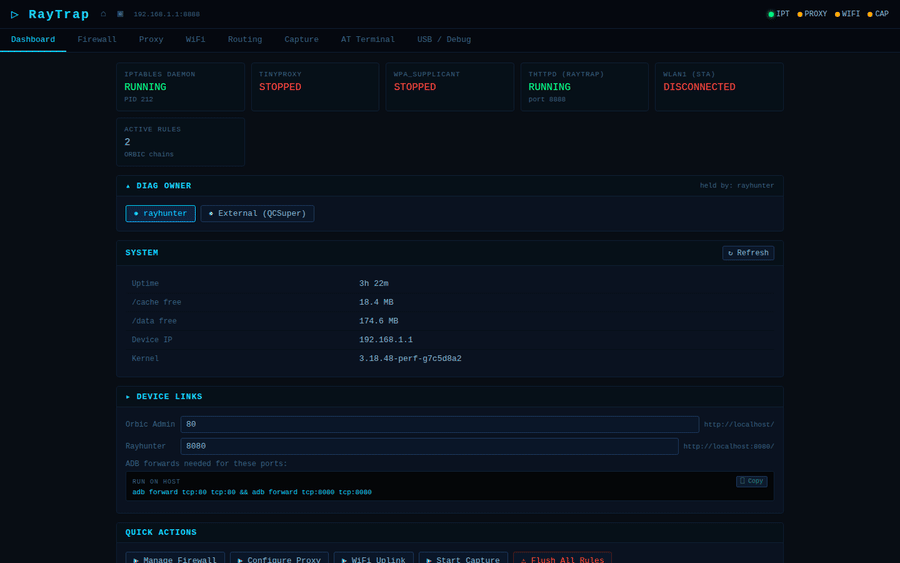

# RayTrap — Unified Web Control Interface

RayTrap is a browser-based control UI running on the Orbic RC400L. It surfaces the iptables daemon, tcpdump, tinyproxy, wpa_supplicant, and policy routing behind a single-page interface accessible over ADB tunnel — no rootshell required after initial deploy.

Developed as part of the [RC400L research project](README.md). All capabilities described here are documented step-by-step in the main README.

---

<!-- screenshots-updated: 2026-03-11 -->
<!-- AUTO-UPDATED: .github/workflows/screenshots.yml regenerates raytrap_demo.gif on every push touching www/ -->



---

## Prerequisites

- **Rayhunter installed** — provides root access via `rootshell`. See [EFF Rayhunter](https://github.com/EFForg/rayhunter) for install.
- **ADB working** — `adb devices` shows the device as authorized.
- **Repo root** — all commands below assume you're running from the repo root.

The deploy script is self-contained: it installs tinyproxy, tcpdump, libpcap, and all CGI scripts. No prior setup is needed. The Firewall, Proxy, Routing, and WiFi tabs will show their service status as 🔴 if the backing service (iptables daemon, wpa_supplicant) isn't running — those can be deployed separately via `PortableApps/01_xtables/` if needed.

---

## Deploy

```bash
# Push the package (Windows Git Bash: set MSYS_NO_PATHCONV=1 first)
adb push PortableApps/26_raytrap /data/tmp/raytrap

# Open a rootshell and run the installer
adb shell
rootshell
sh /data/tmp/raytrap/deploy.sh

# Clean up staging (non-root adb shell, not rootshell)
exit          # back to adb shell
rm -rf /data/tmp/raytrap
```

The deploy script:
1. Verifies busybox httpd is available and the package is complete
2. Stops any existing httpd on port 8888
3. Installs `tinyproxy`, `tcpdump`, `libpcap.so.1` to `/cache/bin/` and `/cache/lib/`
4. Creates `/cache/raytrap/www/cgi-bin/` and `/cache/raytrap/captures/`
5. Installs all CGI scripts (chmod 755) and `index.html`
6. Patches `/etc/init.d/misc-daemon` to launch RayTrap at boot (after modem ONLINE)
7. Injects a `once` inittab entry, signals PID 1, waits for port 8888
8. Removes the `once` entry

**Boot persistence**: after the first deploy, RayTrap starts automatically on every subsequent reboot — no further action needed.

---

## Access

```bash
adb forward tcp:8889 tcp:8888
# Open in browser:  http://127.0.0.1:8889/
```

```
┌──────────────────┐           ADB USB           ┌──────────────────────────────┐
│   Laptop / PC    │◄──────────────────────────►│   Orbic RC400L               │
│                  │                             │                              │
│  browser         │                             │  busybox httpd               │
│  :8889  ─────────┼── tcp:8889 → tcp:8888 ──────┼──► :8888                   │
│                  │                             │      │                       │
│  adb forward     │                             │  /cache/raytrap/www/         │
│  tcp:8889        │                             │  cgi-bin/*.cgi               │
│  tcp:8888        │                             │                              │
└──────────────────┘                             └──────────────────────────────┘
```

**Note**: `status.cgi` polls 7–8 services on load — allow ~9 seconds for the Dashboard to fully populate over ADB tunnel.

---

## Tabs

### Dashboard

Live status poll every 15 seconds. Shows 🟢/🔴 indicators for:
- iptables daemon (`/cache/ipt/cmd.fifo` + `CapEff`)
- tinyproxy (PID + port 8118 listening state)
- wpa_supplicant on `wlan1` (connection state, SSID, IP)
- Active tcpdump capture (PID, interface, elapsed time)

System panel: uptime, `/cache` and `/data` free space, kernel version.

DIAG Owner panel: toggle `/dev/diag` between rayhunter and external tools (QCSuper). Includes LTE Stop/Start controls and QCMAP status badge.

---

### Firewall

Add and delete rules in the `ORBIC_PREROUTING` (nat) and `ORBIC_MANGLE` chains without touching any QCMAP chain. QCMAP remains fully functional and unaware of the custom chains.

Five rule presets:

| Preset | Chain | Target | Use Case |
|---|---|---|---|
| Mirror (TEE) | mangle ORBIC_MANGLE | `TEE --gateway <IP>` | Passive Wireshark capture of all WiFi client traffic |
| Redirect Port | nat ORBIC_PREROUTING | `REDIRECT --to-ports <port>` | Transparent port hijack (e.g. port 80 → tinyproxy) |
| Forward to Host (DNAT) | nat ORBIC_PREROUTING | `DNAT --to-destination <IP:port>` | Redirect traffic to a different host (DNS, capture server) |
| Block Source | filter ORBIC_FILTER | `DROP` | Block a specific client IP or subnet |
| Mark Traffic | mangle ORBIC_MANGLE | `MARK --set-mark <val>` | Tag flows for policy routing on the Routing tab |

Active rules table shows all entries in `ORBIC_*` chains with type badges and per-rule delete buttons.

---

### Proxy

tinyproxy lifecycle control:
- **Start / Stop** — launches tinyproxy via the inittab escape (full caps required for `CAP_NET_BIND_SERVICE`)
- **Transparent HTTP** toggle — adds/removes the port 80 REDIRECT rule automatically
- **Config editor** — inline edit of port, log level, allow subnet, max clients, timeout
- **Log tail** — live last-30-lines of tinyproxy access log

Default config: port 8118, log level `connect`, allow `192.168.1.0/24`.

**Transparent proxy flow:**

```diff
  Client request: GET http://example.com/ HTTP/1.1
                              │
  ┌─────────────────────────────────────────────────┐
  │ iptables nat ORBIC_PREROUTING                   │
  │ -p tcp --dport 80 -j REDIRECT --to-ports 8118  │
  └────────────────────────┬────────────────────────┘
                           │ port 80 → port 8118
                           ▼
  ┌─────────────────────────────────────────────────┐
  │ tinyproxy :8118                                 │
  │ logs: GET http://example.com/ from 192.168.1.x  │
  └────────────────────────┬────────────────────────┘
                           │ forwarded upstream
                           ▼
                    rmnet0 (LTE) → Internet
```

---

### WiFi

wpa_supplicant STA management on `wlan1` (runs alongside `wlan0` AP in concurrent mode):

- Connection state, current SSID, IP address, wpa_supplicant PID
- **Add Network** — SSID + passphrase (blank for open); calls `wpa_cli add_network / set_network / enable_network / select_network`
- **Saved networks table** — per-row connect/remove buttons, current/saved status badges
- Raw `wpa_cli status` log panel

**Scanning limitation**: passive channel scan returns empty while `wlan0` AP is active (radio can't go off-channel without disrupting AP clients). Enter the SSID directly — the supplicant will associate when it hears the target beacon on the current channel.

**Dual-uplink topology:**

```
                              ┌──────────────────────────────┐
   WiFi Clients               │   Orbic RC400L               │
   192.168.1.x ──►  wlan0  ──►│                              │
                    bridge0   │  MARK rules (Routing tab)    │
                              │                              │
                              │  Table 100 (LTE)    ──────►  rmnet0  ──► Internet (LTE)
                              │  Table 200 (WiFi)   ──────►  wlan1   ──► Upstream WiFi AP
                              │                              │
                              │  Per-client routing:         │
                              │  client A → table 100 (LTE)  │
                              │  client B → table 200 (WiFi) │
                              └──────────────────────────────┘
```

---

### Routing

Policy routing control using `ip rule` and separate routing tables:

- **Table 100** — LTE uplink via `rmnet0`
- **Table 200** — WiFi STA uplink via `wlan1`
- **Initialize Routing Tables** button — runs one-time `ip route add` to populate both tables
- **Per-client assignment** — route a specific WiFi client's traffic through either uplink using MARK rules

Requires the iptables daemon to be running (for `MARK` rule injection) and wpa_supplicant associated on `wlan1` for table 200 to have a route.

---

### Capture

tcpdump control with browser-based PCAP download:

- **Interface picker**: `bridge0`, `wlan0`, `rmnet0`, `wlan1`, `any`
- **BPF filter** text field (e.g. `port 53`, `host 192.168.1.50`, `not port 22`)
- **Duration**: 30s / 60s / 5m / unlimited
- **Filename prefix**: optional label prepended to the capture filename
- Start / Stop / Refresh buttons
- Active capture: PID, interface, filename, elapsed time
- Saved captures: file sizes + Download link (served as `Content-Disposition: attachment`)

**TEE mirror + Capture workflow** (passive interception, no client changes):

```
Step 1: Firewall tab → Mirror (TEE) → gateway = 192.168.1.XX (this laptop)
Step 2: Capture tab  → interface = bridge0 → Start

🔵 All WiFi client packets are duplicated at mangle/PREROUTING
🔵 Laptop receives copy on wlan0 interface
🟢 tcpdump captures to /cache/raytrap/captures/*.pcap
🟢 Download link appears after Stop — open in Wireshark
```

```
   WiFi Client A ──►─┐
   WiFi Client B ──►─┤                             Capture Host (Laptop)
   WiFi Client C ──►─┤  bridge0                    192.168.1.XX
                     ├──────────────► ORBIC_MANGLE ──► TEE ──────────────► Wireshark
                     │                (mangle table)
                     │
                     └──────────────► rmnet0 ──────────────────────────► Internet
                                      (normal routing, clients unaffected)
```

---

## PCAP Workflows

### Path A — Capture Tab (File Download)

The simplest workflow. tcpdump writes to `/cache/raytrap/captures/` and you download the `.pcap` when done.

1. **Firewall tab** → add Mirror (TEE) rule if you want WiFi client traffic (optional — skip for rmnet0 capture)
2. **Capture tab** → pick interface, enter BPF filter, set duration → **Start**
3. Wait for capture to complete (or click **Stop**)
4. Saved captures list → **Download** → opens file save dialog
5. Open in Wireshark on PC

```diff
+ Interface options:
+   bridge0  — all WiFi client traffic (most common for hotspot research)
+   wlan0    — 802.11 management frames + data before bridging
+   rmnet0   — LTE uplink traffic (what leaves the device to the carrier)
+   wlan1    — upstream WiFi STA traffic (if wpa_supplicant is associated)
+   any      — all interfaces simultaneously
```

### Path B — QCSuper Direct (DIAG Layer)

QCSuper connects directly to the modem's DIAG interface on `COM15` (Qualcomm HS-USB Diagnostics). This captures at the DIAG protocol layer — deeper than tcpdump, includes radio/modem internal events.

Requires: [QCSuper](https://github.com/P1sec/QCSuper) installed, Python venv, libusb.

```bash
# From repo root (Windows Git Bash):
cd qcsuper
PATH="$PATH:venv/Lib/site-packages/libusb/_platform/windows/x86_64" \
  venv/Scripts/python qcsuper.py --usb-modem COM15 --info
```

The Rayhunter fork pre-applies the DIAG log mask at startup (seeds `/dev/diag` with saved `[log_mask]` from `config.toml`, then releases it in `debug_mode=true`). Use the **Capture tab** DIAG Owner panel to set owner to "External" before connecting QCSuper — this ensures `/dev/diag` is available.

```
DIAG log mask categories (set via Capture tab → Mask):
  🟢 LOG_1X     — CDMA/EVDO (no-op on LTE-only RC400L)
  🟢 LOG_HDR    — EVDO (no-op)
  🟢 LOG_GSM    — GSM (no-op)
  🟢 LOG_UMTS   — WCDMA (no-op)
  🟢 LOG_LTE    — LTE air interface, RRC, NAS ← primary signal
  🟢 LOG_WLAN   — 802.11 MAC/PHY
  🟢 LOG_QCNEA  — network evaluation framework
  ... (14 categories total — see SideQuests/Rayhunter_Fork.md)
```

### Path C — Rayhunter Fork Stream Endpoint

The rayhunter fork exposes raw DIAG frames as a chunked HTTP stream. Useful for piping into custom parsers or tools that can consume chunked octet-stream.

```bash
# ADB forward rayhunter's port:
adb forward tcp:2828 tcp:2828

# Stream raw DIAG bytes to stdout:
curl -s http://127.0.0.1:2828/api/stream | hexdump -C | head -50

# Or save to file for offline analysis:
curl -s http://127.0.0.1:2828/api/stream > diag_capture.bin
```

The stream runs indefinitely until the connection is closed. Rayhunter must be the DIAG owner (Capture tab → "Set rayhunter as owner") for the stream to contain data.

---

## iptables Recipes

All rules are injected via the ipt daemon FIFO. They survive until the device reboots or the FIFO receives a flush command. The Firewall tab in RayTrap handles the common cases — these are the raw commands for scripting or custom rules.

**Syntax**: `sh /cache/ipt/ipt_ctl.sh iptables [args]` (or via Firewall tab form).

### Mirror All WiFi Client Traffic (TEE)

```bash
sh /cache/ipt/ipt_ctl.sh iptables \
    -t mangle -A ORBIC_MANGLE \
    -i bridge0 \
    -j TEE --gateway 192.168.1.50
```

Replace `192.168.1.50` with your Wireshark host IP. The mirror copy arrives on whichever interface of the capture host faces the Orbic network — start Wireshark on that interface.

**Single client only:**

```bash
sh /cache/ipt/ipt_ctl.sh iptables \
    -t mangle -A ORBIC_MANGLE \
    -i bridge0 -s 192.168.1.152 \
    -j TEE --gateway 192.168.1.50
```

### Transparent HTTP Redirect

```bash
sh /cache/ipt/ipt_ctl.sh iptables \
    -t nat -A ORBIC_PREROUTING \
    -i bridge0 -p tcp --dport 80 \
    -j REDIRECT --to-ports 8118
```

Redirects all WiFi client HTTP to tinyproxy on port 8118. Enable via **Proxy tab → Transparent HTTP toggle** to have RayTrap manage this rule automatically (adds rule on enable, removes on disable).

### REDIRECT to Specific Service

```bash
# Port 777 → rayhunter web UI on 8080:
sh /cache/ipt/ipt_ctl.sh iptables \
    -t nat -A ORBIC_PREROUTING \
    -i bridge0 -p tcp --dport 777 \
    -j REDIRECT --to-ports 8080
```

### DNAT to External Host

```bash
# Redirect client DNS to a custom resolver at 10.0.0.1:
sh /cache/ipt/ipt_ctl.sh iptables \
    -t nat -A ORBIC_PREROUTING \
    -i bridge0 -p udp --dport 53 \
    -j DNAT --to-destination 10.0.0.1:53
```

### TPROXY (TLS Interception Path)

TPROXY requires a local TLS proxy listening on the target port with its own certificate. This rule sets up the kernel-side redirect:

```bash
# Mark traffic first (TPROXY requires mark-based routing):
sh /cache/ipt/ipt_ctl.sh iptables \
    -t mangle -A ORBIC_MANGLE \
    -i bridge0 -p tcp --dport 443 \
    -j TPROXY --on-port 8443 --tproxy-mark 1

# Add the policy routing rule (so marked packets go to local process):
sh /cache/ipt/ipt_ctl.sh ip rule add fwmark 1 lookup 100
sh /cache/ipt/ipt_ctl.sh ip route add local 0.0.0.0/0 dev lo table 100
```

Then start a TLS MITM proxy (e.g. mitmproxy, sslsplit) on port 8443 — must be launched via inittab escape for full capabilities.

### Mark Traffic for Policy Routing

```bash
# Mark client 192.168.1.152 for wlan1 STA uplink (table 200):
sh /cache/ipt/ipt_ctl.sh iptables \
    -t mangle -A ORBIC_MANGLE \
    -i bridge0 -s 192.168.1.152 \
    -j MARK --set-mark 200

sh /cache/ipt/ipt_ctl.sh ip rule add fwmark 200 lookup 200
```

Use the **Routing tab** "Initialize Routing Tables" button first to populate tables 100 and 200.

### View and Flush Rules

```bash
# View all ORBIC_* chain rules:
sh /cache/ipt/ipt_ctl.sh status

# Flush all ORBIC_* chains (keeps QCMAP rules):
sh /cache/ipt/ipt_ctl.sh flush

# Individual rule delete (by rule number):
sh /cache/ipt/ipt_ctl.sh iptables -t mangle -D ORBIC_MANGLE 1
```

---

## Files

All source in `PortableApps/26_raytrap/`:

| File | Role |
|---|---|
| `deploy.sh` | One-step installer, run from rootshell |
| `raytrap/start.sh` | Manual start script (used by raytrap_daemon) |
| `raytrap/raytrap_daemon` | `/etc/init.d/` service script (start/stop/status) |
| `raytrap/tinyproxy` | HTTP proxy binary (ARM, glibc 2.22) |
| `raytrap/tcpdump` | Packet capture binary (ARM, glibc 2.22) |
| `raytrap/libpcap.so.1` | libpcap shared library |
| `raytrap/tinyproxy.conf` | Default tinyproxy configuration |
| `raytrap/www/index.html` | Single-page web UI (~875 lines, vanilla JS) |
| `raytrap/www/cgi-bin/status.cgi` | System overview, service PIDs, DIAG owner |
| `raytrap/www/cgi-bin/firewall.cgi` | ORBIC_* chain rule management |
| `raytrap/www/cgi-bin/proxy.cgi` | tinyproxy lifecycle + config |
| `raytrap/www/cgi-bin/wifi.cgi` | wpa_supplicant network management |
| `raytrap/www/cgi-bin/routing.cgi` | ip rule + policy routing tables |
| `raytrap/www/cgi-bin/capture.cgi` | tcpdump start/stop + PCAP download |
| `raytrap/www/cgi-bin/diag.cgi` | DIAG owner toggle, LTE control, QCMAP ensure |

The Rayhunter fork patch (`PortableApps/26_raytrap/rayhunter_fork/daemon/src/main.rs`) seeds the DIAG log mask at every startup — documented in [SideQuests/Rayhunter_Fork.md](SideQuests/Rayhunter_Fork.md).

---

## Troubleshooting

**RayTrap not responding after deploy**

Check if httpd is running: `adb shell cat /proc/net/tcp6 | grep 22B8` (0x22B8 = port 8888). If absent, the inittab injection may have failed. Rerun deploy.

**Dashboard loads but shows all services red**

`status.cgi` takes ~6–9 seconds over ADB tunnel. Wait, then refresh. If the iptables daemon shows red, verify `ls -la /cache/ipt/cmd.fifo` exists.

**Firewall rules not taking effect**

The iptables daemon must be running (green on Dashboard). Deploy `PortableApps/01_xtables/` if it isn't — that package installs the FIFO daemon that the Firewall tab uses to inject rules.

**Transparent proxy not intercepting traffic**

Verify the REDIRECT rule is active (Firewall tab → active rules table). Verify tinyproxy is running (Proxy tab → PID shown). Verify client is connecting through the Orbic hotspot and not directly to another AP.

**WiFi tab shows wpa_supplicant not running**

wpa_supplicant is deployed as part of `PortableApps/01_xtables/`. Check `ps | grep wpa_supplicant` from rootshell to verify it launched.

**PCAP download returns empty file**

Verify tcpdump has write access to `/cache/raytrap/captures/`. Run `ls -la /cache/raytrap/captures/` from rootshell to check permissions and existing files.
